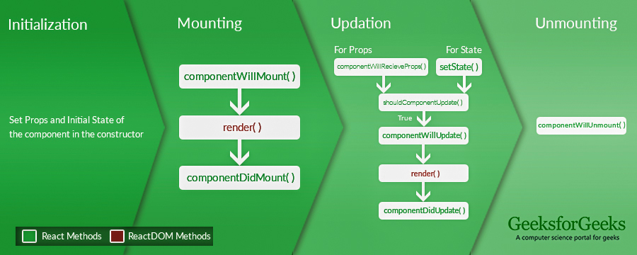

# React Basics

- **What is React?**
    - React is a declarative, efficient, and flexible JavaScript library for building user
      interfaces. It lets you compose complex UIs from small and isolated pieces of code called
      “components”.
    - React is a Javascript library, not a framework. What does this mean? A library provides
      methods and classes that will help you with your application design and control flow. A
      framework provides an application design and a control flow which will take your code and call
      it for you. React is a library, so it gives you the control and provides classes and methods
      that will help you.
- **What does React do?**
    - React's primary purpose is to help you render to the DOM. React makes it easy to put elements
      on the DOM, respond to user interaction, and change elements on the DOM __only when they need
      to change__.

### Components

- A component takes in parameters, called props (short for “properties”), and returns a
  hierarchy of views to display typically written in "JSX"
- React excels at creating small components, or pieces, that fit together to make something
  bigger. Building with components makes it easier to test and find problems, easier to work
  with a group on the same project, and easier to make changes later.
- "Your components tell React what you want to render – then React will efficiently update and
  render just the right components when your data changes.". In React, a page could be a
  component built of many smaller components which each handle different tasks. This way,
  anytime we need to change anything, we know exactly where to make the change, and the change
  will happen everywhere we use that component.
- React has Class based components, but we exclusively use Functional components at COVR because of
  hooks.

```js
// Class component
class Democomponent extends React.Component {
  render() {
    return <h1>Welcome Message!</h1>;
  }
}
```

```js
// Functional component
const Democomponent = () => {
  return <h1>Welcome Message!</h1>;
}
```

### JSX

- Most React developers use a special syntax called “JSX” similar to HTML markup. The `<div />`
  syntax is transformed at build time to `React.createElement('div')`.
- JSX comes with the full power of JavaScript. **You can put any JavaScript expressions within
  braces inside JSX**.
- Each React element is a JavaScript object that you can store in a variable or pass around in
  your program.

```typescript jsx
// Typescript component example

// Local props type definition
type Props = {
  name: string
}

// Using shorthand to type a React Functional Component
const ShoppingList: React.FC<Props> = (props) => {
  return (
    // JSX attributes are TYPICALLY camelCase equvialent of HTML attributes
    <div className="shopping-list">
      <h1>Shopping List for {props.name}</h1>
      <ul>
        <li>Instagram</li>
        <li>WhatsApp</li>
        <li>Oculus</li>
      </ul>
    </div>
  )
}
```

### Virtual DOM

- The DOM, or Document Object Model, is the structure of objects created by HTML. React stands
  between you and the DOM to make rendering simpler and to make performance better. React does
  this by working with a virtual DOM.
- Think of the virtual DOM as React's local and simplified copy of the HTML DOM. It allows React
  to do its computations within this abstract world and skip the 'real' DOM operations, often
  slow and browser-specific.
- There's no big difference between the 'regular' DOM and the virtual DOM. This is why the JSX
  parts of the React code can look almost like pure HTML.

### Unidirectional Data Flow

- React was designed partially to solve problems that existed in a different pattern of data flow
  called MVC.
- Data flows in ONE direction: **Parent to Child**
- This data flow is achieved by passing data to components via props.

### State

- Components can each have their own state - a component's state is private data that it does not
  share with other components. This state is data that might change, and should help the component
  do its job.

### Keys

- A “key” is a special string attribute you need to include when creating lists of elements in
  React. Keys are used to React to identify which items in the list are changed, updated, or
  deleted.
- Keys used within arrays should be **unique among their siblings**. However, they don’t need to be
  globally unique.

```typescript jsx
type Item = {
  id: string
  value: string
}
type Props = {
  items: Item[]
}
const List: React.FC<Props> = ({ items }) => {
  return (
    <ul>
      {items.map((item) => (
        // Do not use the item index as a key
        <li key={item.id}>
          {item.value}
        </li>
      ))}
    </ul>
  )
}
```

### Hooks
- Hooks are a new addition in React 16.8. They let developers use state and other React features without writing a class For example- State of a component
- Hooks are available for React version 16.8 or higher.
- Hooks are completely opt-in. Use it partially for a few components or base the whole project on it as per your needs without rewriting any existing code. 
- Hooks don’t contain any breaking changes and are 100% backward-compatible.
- The react team has no plan to remove classes from React.
- Hooks can’t be used inside class components and but the app can definitely mix class-based components and functional components with Hooks.
- Hooks doesn’t violate any existing React concepts. Instead, Hooks provide a direct API to react concepts such as props, state, context, refs and life-cycle.


### Component Lifecycle

- Initialization: This is the stage where the component is constructed with the given Props and
  default state. This is done in the constructor of a Component Class.
- Mounting: Mounting is the stage of rendering the JSX returned by the render method itself.
- Updating: Updating is the stage when the state of a component is updated and the application is
  repainted.
- Unmounting: As the name suggests Unmounting is the final step of the component lifecycle where the
  component is removed from the page.
  

# Getting Started with Create React App

This project was bootstrapped with [Create React App](https://github.com/facebook/create-react-app).

## Available Scripts

In the project directory, you can run:

### `npm start`

Runs the app in the development mode.\
Open [http://localhost:3000](http://localhost:3000) to view it in the browser.

The page will reload if you make edits.\
You will also see any lint errors in the console.

### `npm test`

Launches the test runner in the interactive watch mode.\
See the section
about [running tests](https://facebook.github.io/create-react-app/docs/running-tests) for more
information.

### `npm run build`

Builds the app for production to the `build` folder.\
It correctly bundles React in production mode and optimizes the build for the best performance.

The build is minified and the filenames include the hashes.\
Your app is ready to be deployed!

See the section about [deployment](https://facebook.github.io/create-react-app/docs/deployment) for
more information.

### `npm run eject`

**Note: this is a one-way operation. Once you `eject`, you can’t go back!**

If you aren’t satisfied with the build tool and configuration choices, you can `eject` at any time.
This command will remove the single build dependency from your project.

Instead, it will copy all the configuration files and the transitive dependencies (webpack, Babel,
ESLint, etc) right into your project so you have full control over them. All of the commands
except `eject` will still work, but they will point to the copied scripts so you can tweak them. At
this point you’re on your own.

You don’t have to ever use `eject`. The curated feature set is suitable for small and middle
deployments, and you shouldn’t feel obligated to use this feature. However we understand that this
tool wouldn’t be useful if you couldn’t customize it when you are ready for it.

## Learn More

You can learn more in
the [Create React App documentation](https://facebook.github.io/create-react-app/docs/getting-started)
.

To learn React, check out the [React documentation](https://reactjs.org/).
